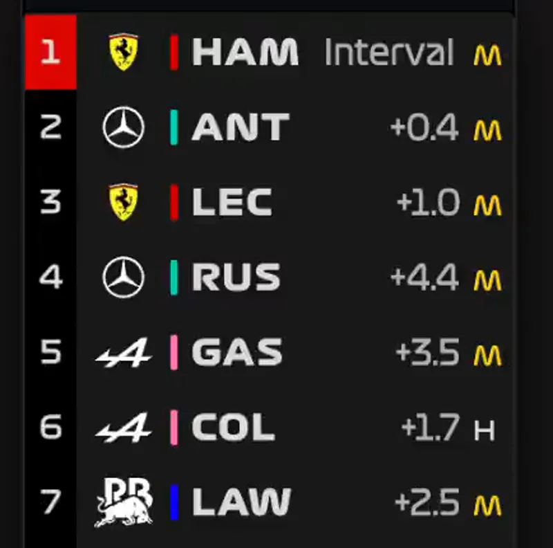
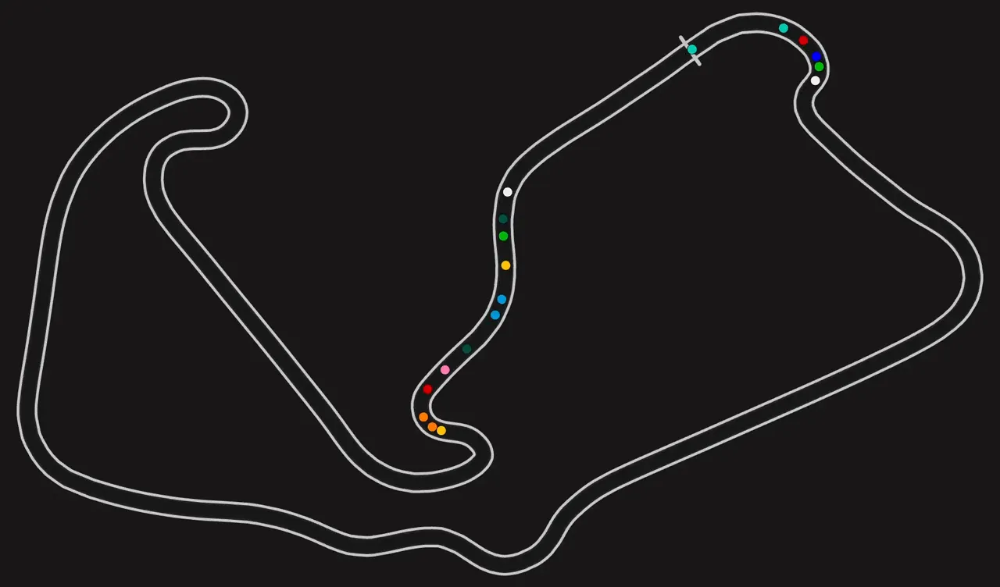
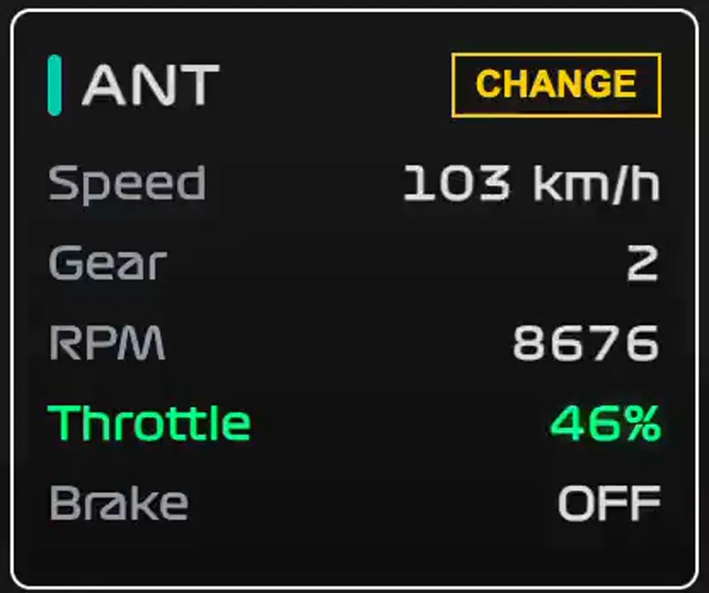
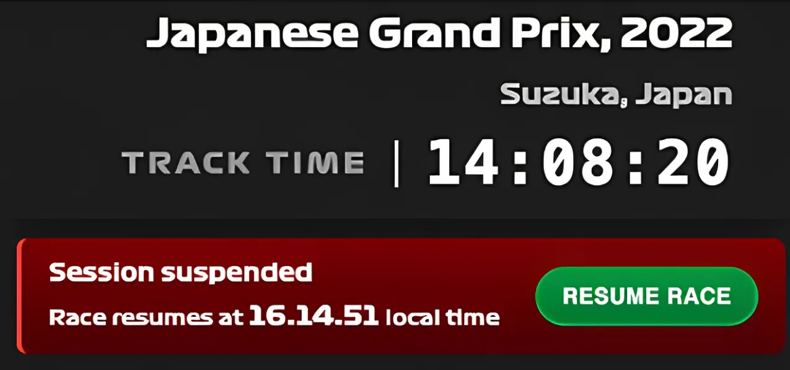
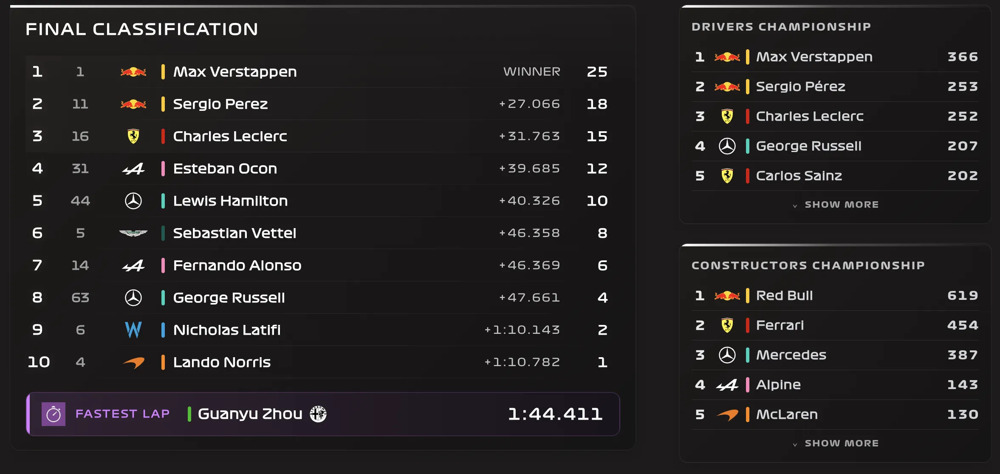
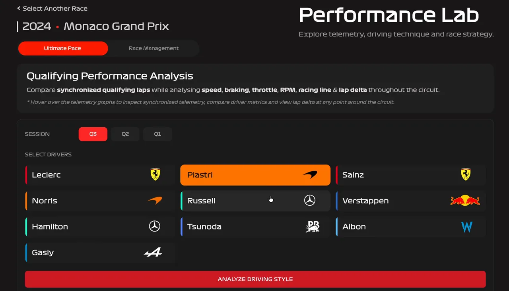
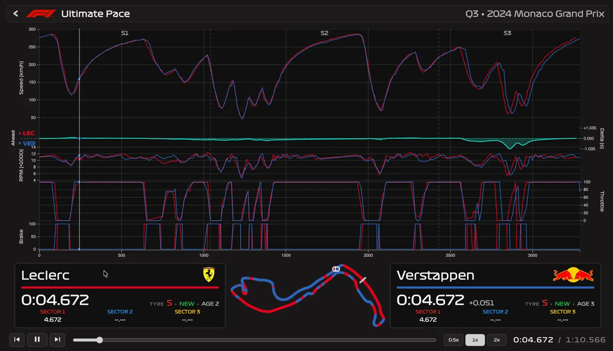
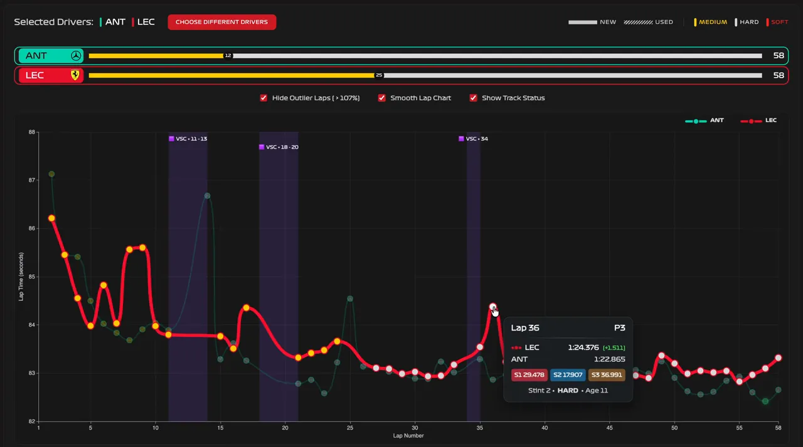

# PITWALL

### Replay. Analyze. Experience Formula 1.

PitWall is an Angular-based Formula 1 race replay and performance-analysis application. It turns historic race-session data into an interactive experience where users can replay a Grand Prix, follow the race as it unfolds, inspect synchronized telemetry, and compare driver performance.

**Live application:** https://pitwallf1.pages.dev/

> **Note:** PitWall is an independent fan/engineering project and is not affiliated with Formula 1, the FIA, or any Formula 1 team.

---

## What PitWall Does

PitWall is organized around two experiences:

```text
PITWALL
│
├── Race Simulation
│   ├── Select a historic Grand Prix
│   ├── Review qualifying and starting grid
│   ├── Replay the race
│   ├── Follow the live leaderboard
│   ├── Watch cars move around the circuit
│   ├── Inspect weather and track status
│   ├── Follow race-control messages
│   ├── Inspect driver telemetry
│   ├── Seek through red-flag interruptions
│   └── View the final FIA classification
│
└── Performance Lab
    ├── Ultimate Pace
    │   └── Qualifying / driving-style comparison
    │
    └── Race Management
        ├── Stints and tyre usage
        ├── Clean-lap recommendations
        ├── Race-lap comparison
        └── Race performance analysis
```

---

# Race Simulation

Select a season and Grand Prix, review qualifying and the starting grid, then launch the race simulation.

### Live leaderboard

Track running position, intervals, gaps, position changes, and race state while the simulation progresses.



### Interactive track map

Cars are positioned using race telemetry and move around an SVG circuit as the simulation clock advances.



### Driver telemetry

Inspect synchronized driver telemetry including speed, gear, RPM, throttle, and brake state while the race is being replayed.



### Race playback controls

The simulation provides play/pause/stop controls, adjustable playback speeds, a race clock, and synchronized updates across the leaderboard, track map, telemetry, weather, and race-control state.

### Red-flag seek

When a red flag interrupts a race, PitWall can jump directly to the calculated restart window instead of forcing the user to replay the interruption period.



### FIA classification

After the chequered flag, the simulation transitions to the race result state with the official classification, intervals, fastest-lap information, and championship standings at the end of the race.



---

# Performance Lab

Performance Lab provides deeper analysis after selecting a Grand Prix from the race-selection page.

## Ultimate Pace

Compare up to two drivers from the same qualifying session (Q1, Q2, or Q3). The comparison combines synchronized telemetry and track position to show how drivers differ through a lap.

Metrics include:

- Speed
- RPM
- Throttle
- Brake
- Lap delta
- Track position
- Sector timing





## Race Management

Race Management focuses on race execution rather than a single qualifying lap.

PitWall analyzes stints, tyre usage, lap validity, race pace, traffic, wake effects, DRS usage, and lap compatibility to recommend comparable race laps.

Users can then select the recommended laps—or choose laps manually—and move into a synchronized race-lap comparison.



---

# Frontend Architecture

The application is built as a standalone-component Angular application with feature-oriented services and route guards.

```text
Angular Application
│
├── Core
│   ├── Domain models
│   ├── API/data services
│   ├── Race clock
│   ├── Leaderboard / live timing
│   ├── Telemetry buffering
│   ├── Track map state
│   ├── Race control / track status
│   └── PWA services
│
├── Simulation
│   └── Replay-specific utilities and synchronization
│
├── Comparison
│   ├── Comparison models
│   ├── Lap playback
│   ├── Telemetry hover state
│   └── Comparison theme
│
├── Pages
│   ├── Home
│   ├── Race Selection
│   ├── Qualifying
│   ├── Simulation
│   ├── Performance Lab
│   ├── Qualifying Comparison
│   └── Race Comparison
│
├── Shared
│   ├── Components
│   └── Pipes
│
└── Layout
```

### Route flow

```text
Home
  │
  ▼
Race Selection
  │
  ├── Qualifying ──► Simulation
  │
  └── Performance Lab
          ├── Ultimate Pace ──► Qualifying Comparison
          └── Race Management ──► Race Comparison
```

Navigation guards are used to protect feature flows and ensure the required race/driver context is available before entering comparison and simulation pages.

---

# Synchronization Model

A major part of the frontend is keeping multiple visualizations synchronized to a common race timeline.

```text
                    Race Clock
                        │
         ┌──────────────┼──────────────┐
         │              │              │
         ▼              ▼              ▼
     Leaderboard     Track Map      Telemetry
         │              │              │
         └──────────────┼──────────────┘
                        │
                 Race State
                        │
            ┌───────────┼───────────┐
            ▼           ▼           ▼
         Weather    Track Status  Race Control
```

The simulation uses dedicated services for clock management, telemetry buffering, interpolation, live timing, driver state, track-map state, weather, and race-control processing.

---

# Progressive Web App

PitWall is designed as a responsive web application with Progressive Web App support.

The frontend includes:

- Angular Service Worker
- Web app manifest
- Install support
- PWA-aware runtime detection
- Lazy loading for static assets
- Production service-worker registration

The production application registers the service worker after the application becomes stable.

---

# Technology Stack

| Area | Technology |
|---|---|
| Framework | Angular 18 |
| Language | TypeScript |
| Reactive programming | RxJS |
| UI | Angular Material + custom SCSS |
| Charts | Apache ECharts, ngx-echarts, Chart.js |
| Visualization | D3 modules |
| PWA | Angular Service Worker |
| Styling | SCSS + custom Formula 1-inspired typography |
| Hosting | Cloudflare Pages |

---

# API Integration

The frontend communicates with the FastAPI backend through relative `/api` paths.

During local development, `proxy.conf.json` forwards `/api` requests to:

```text
http://127.0.0.1:8000
```

This keeps API calls identical between development and production from the application's perspective.

---

# Local Development

## Prerequisites

- Node.js
- npm
- Running PitWall backend API

## Install

```bash
npm install
```

## Start development server

```bash
npm start
```

Then open:

```text
http://localhost:4200
```

## Build production bundle

```bash
npm run build
```

## Run unit tests

```bash
npm test
```

---

# Project Scripts

| Command | Purpose |
|---|---|
| `npm start` | Start Angular development server |
| `npm run build` | Build production bundle |
| `npm run watch` | Continuous development build |
| `npm test` | Run Karma/Jasmine tests |

---

# Performance Work

PitWall's frontend is designed around a backend that performs substantial time-series processing, so the UI uses buffering and interpolation rather than repeatedly requesting raw telemetry during animation.

The production telemetry API generates the complete race telemetry once and then serves requested time windows from the cached result. This makes subsequent ten-minute animation-window requests extremely fast compared with recomputing the race.

The project also went through a benchmark-driven backend optimization pass with frozen baseline outputs and regression validation to ensure performance changes did not change the displayed race data.

---

# Repository Structure

The frontend repository is intentionally focused on the Angular client.

```text
/
├── public/
│   ├── icons/
│   ├── manifest.webmanifest
│   ├── robots.txt
│   └── sitemap.xml
├── src/
│   ├── app/
│   ├── assets/
│   │   └── features/
│   ├── main.ts
│   └── styles.scss
├── angular.json
├── ngsw-config.json
├── package.json
├── proxy.conf.json
└── tsconfig*.json
```

---

# Backend

The Angular application depends on the separate PitWall backend repository for FastAPI/FastF1 data processing.

The backend is responsible for session loading, caching, race reconstruction, telemetry processing, comparison data, and Performance Lab analysis.

---

## PitWall in one sentence

> **A Formula 1 time-series visualization platform that turns historic race data into an interactive replay and performance-analysis experience.**
